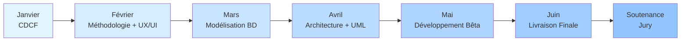

# Analyse Complète du Cahier des Charges Technique
## Projet Fil Rouge CDA (Concepteur Développeur d'Applications)

---

## 📋 Vue d'Ensemble du Projet

**Durée** : 6 mois (Janvier à Juin 2026)  
**Type** : Projet individuel (entraide encouragée)  
**Objectif** : Mener un projet applicatif complet, de l'idée initiale au produit final fonctionnel  
**Évaluation** : Présentation devant un jury en fin de formation

### Complémentarité des Documents
- **CDCF** (Cahier des Charges Fonctionnel) → décrit le **"QUOI"** (besoins et fonctionnalités)
- **CDCT** (Cahier des Charges Technique) → décrit le **"COMMENT"** (implémentation, architecture, outils)

---

## 🛠️ Stack Technologique Imposée (Non Négociable)

### Back-end : Symfony (PHP)
- **Version** : Symfony LTS (Long Term Support) recommandée
- **Langage** : PHP 8+
- **Architecture** : 2 options au choix
  1. Application **monolithique** Symfony (back-end + front-end avec Twig)
  2. **API RESTful** Symfony + front-end séparé (React/Angular)

> ⚠️ **Important** : Justifier votre choix d'architecture dans le CDCF avec une analyse comparative

### Front-end

**Option 1 : Full Symfony**
- Twig / HTML / CSS
- Framework CSS au choix (Bootstrap, Tailwind, etc.)
- JavaScript

**Option 2 : SPA (Single Page Application)**
- **React** (v18+) OU **Angular** (v15+)
- Dernière version stable

**Exigences communes** :
- ✅ Interface **responsive** (desktop + mobile)
- ✅ UX/UI soignée (charte graphique cohérente, ergonomie travaillée)

### Base de Données
- **SGBD** : MySQL/MariaDB, PostgreSQL ou SQL Server
- ❌ **NoSQL INTERDIT**
- **Modélisation** : Méthode MERISE obligatoire
- **Implémentation** : ORM Doctrine recommandé (ou SQL pur)
- **Normalisation** : Forme normale 3NF attendue

### API Externe (Obligatoire)
Intégrer **au moins 1 API tierce** :
- Google Maps, OpenWeatherMap
- OAuth (Google/Facebook)
- API de paiement (Stripe, PayPal)
- Etc.

**Sécurité des clés** :
- ✅ Variables d'environnement (fichier `.env`)
- ❌ Jamais codées en dur dans le code

### Conteneurisation : Docker
- **Docker** obligatoire pour tous les services
- **Docker Compose** pour orchestrer :
  - Conteneur Symfony + PHP
  - Conteneur Base de données
  - Conteneur Front-end (si séparé)

**Avantages** :
- Environnement uniforme (dev → test → prod)
- Fini les "ça marche sur ma machine" 🎯
- Automatisation complète du déploiement

### Contrôle de Version : Git
- **Plateforme** : GitHub ou GitLab (repo privé ou public)
- **Stratégie de branches** :
  ```
  main/master  → Versions stables (releases jalons)
  develop      → Intégration continue
  feature/*    → Développement de fonctionnalités
  ```
- **Bonnes pratiques** :
  - Commits fréquents et messages clairs
  - Pull requests (si possible)
  - Versionnement des fichiers de config (Docker, CI)

### CI/CD : Intégration et Déploiement Continus

**CI (Continuous Integration)** :
- Pipeline automatisée à chaque push
- Exécution des tests (unitaires + fonctionnels)
- Build/packaging de l'application
- Outils : **GitHub Actions** ou **GitLab CI**

**CD (Continuous Delivery/Deployment)** :
- Build d'images Docker
- Déploiement auto sur pré-prod/prod (si serveur disponible)
- Dépôt sur Docker Hub
- Procédure de mise en production documentée

**Exemple de pipeline** :
```
push sur develop → tests + build Docker
tag release      → déploiement production
```

### Tests Automatisés (Multi-niveaux)

**Tests obligatoires** :
- ✅ **Tests unitaires** (PHPUnit) : composants métier, utils
- ✅ **Tests fonctionnels** : API endpoints, cas d'usage end-to-end
  - Behat, Postman/Newman
  - Jest, React Testing Library (si SPA)
  - Selenium (tests UI)

**Tests appréciés** :
- Tests de performance (temps de réponse, JMeter)
- Tests de sécurité (scans de vulnérabilités)
- Tests d'UI (rendu mobile)

### Sécurité : OWASP Top 10

| **Menace** | **Protection Requise** |
|------------|------------------------|
| **Injection SQL** | Requêtes préparées, ORM Doctrine |
| **XSS** (Cross-Site Scripting) | Échappement Twig, filtrage entrées utilisateur |
| **CSRF** | Tokens CSRF Symfony sur formulaires sensibles |
| **Mots de passe** | Hashage bcrypt/Argon2, politique de complexité |
| **Brute force** | Limitation tentatives, CAPTCHA après X échecs |
| **RGPD** | Suppression compte, politique de confidentialité |

**Authentification** :
- Hashage robuste (jamais en clair)
- Gestion des rôles et permissions
- Limitation des tentatives de connexion

**RGPD** :
- Transparence sur la collecte de données
- Droit à la suppression des données
- Politique de confidentialité (même si fictive)

### Architecture Logicielle

**Pattern MVC** :
- Séparation Vue / Contrôleur / Modèle
- Couche API / Couche métier / Couche d'accès aux données

**Architecture n-tiers** :
- Client (navigateur/app front)
- Serveur web/app (Symfony)
- Base de données (MySQL/PostgreSQL)

**Bonnes pratiques** :
- Principes **SOLID**
- Lisibilité, modularité
- DRY (Don't Repeat Yourself) / KISS (Keep It Simple)
- Conventions PSR pour PHP

---

## 📅 Calendrier Détaillé des 6 Jalons

### 📌 Jalon 1 – Janvier : Cahier des Charges Fonctionnel

**📅 Échéance** : 31/01/2026 (dernier jour ouvrable)  
**📄 Livrable** : CDCF (document PDF)  
**📖 Correspond au** : Chapitre III du rapport final

**Contenu attendu** :

#### 1. Contexte Métier
- Sujet choisi pour l'application
- Domaine/secteur d'activité
- Problème à résoudre ou besoin
- Utilisateurs cibles
- Justification de l'existence du projet

**Exemple** : Application de gestion de bibliothèque en ligne → situation actuelle + intérêt d'une solution numérique

#### 2. Objectifs du Projet (SMART)
- **S**pécifiques
- **M**esurables
- **A**tteignables
- **R**éalistes
- **T**emporellement définis

**Exemples** :
- Permettre aux utilisateurs de réserver des livres en ligne
- Digitaliser le suivi des emprunts
- Réduire les tâches manuelles du bibliothécaire

#### 3. Périmètre Fonctionnel
**Fonctionnalités principales** :
- Gestion des utilisateurs (inscription, connexion, profils, rôles)
- Recherche de livres (titre/auteur)
- Emprunt et réservation en ligne
- Interface d'administration
- Etc.

**Fonctionnalités hors scope** : À préciser clairement

#### 4. Exigences Techniques
- Choix d'architecture (monolithique vs API séparée) **avec justification**
- Stack technique (Symfony, React/Angular, MySQL/PostgreSQL)
- Contraintes imposées (Docker, CI/CD, tests, sécurité)
- Analyse comparative si hésitation entre solutions

#### 5. Contraintes et Enjeux
- Contraintes temporelles (6 mois, jalons mensuels)
- Contraintes réglementaires (RGPD, etc.)
- Risques identifiés (dépendance API tierce, délais courts)
- Hypothèses (ex: API gratuite pour nos volumes)

#### 6. Critères de Succès
Comment savoir que le projet est réussi ?
- Toutes les fonctionnalités implémentées et testées
- Performance acceptable (<1s par requête)
- Interface validée par utilisateurs tests

---

### 📌 Jalon 2 – Février : Méthodologie & Conception UX/UI

**📅 Échéance** : 28/02/2026  
**📄 Livrables** : 2 documents (ou combinés)
1. Documentation méthodologie (PDF)
2. Livrables UX/UI (maquettes, PDF)

**📖 Correspond aux** : Chapitres IV et V du rapport final

#### A. Méthodologie et Organisation

**1. Méthode de Gestion de Projet**
- Agile (Scrum/Kanban) **recommandée**
- Cycle en V (si préféré)
- Justification du choix
- Adaptation en solo (vous êtes PO + Scrum Master + Dev)

**2. Planning Global**
- Diagramme de Gantt ou calendrier
- Grandes phases et jalons
- Lots de travaux par phase
- Outils : MS Project, TeamGantt, Excel

**Exemple de planning** :
```
Février : Design UI/UX
Mars    : Modélisation BD
Avril   : Développement backend
Mai     : Intégration et tests
Juin    : Finalisation et déploiement
```

**3. Outils de Suivi**
- Tableau Trello/Kanban
- Issues GitLab/GitHub
- Colonnes : À faire / En cours / Fait
- Revue hebdomadaire des progrès

**4. Stratégie Git**
- Branches `main`, `develop`, `feature/*`
- Gestion des merges
- Lien du dépôt Git (si déjà initialisé)

**5. Plan CI/CD**
- Pipeline GitHub Actions ou GitLab CI
- Tests automatiques à chaque push
- Déploiement auto Docker (prévu pour mai)

#### B. Conception UX/UI

**1. Zoning / Sitemap**
- Structure globale de l'application
- Disposition des zones (header, menu, contenu, footer)
- Plan de navigation entre pages

**2. Wireframes (Basse Fidélité)**
- Maquettes fil de fer en noir et blanc
- Agencement des éléments (menus, boutons, champs)
- Écrans clés : accueil, liste, détail, formulaires
- Versions desktop ET mobile
- Outils : Figma, Balsamiq, Adobe XD

**3. Charte Graphique**
- **Couleurs** : principales et secondaires (codes hex)
- **Typographies** : titres, texte courant (Google Fonts)
- **Style** : moderne, épuré, fun, professionnel
- **Icônes** : style choisi
- Justification des choix

**4. Maquettes Haute Fidélité**
- Mockups graphiques (apparence finale)
- Minimum 2 écrans : desktop + mobile
- Application de la charte graphique
- Outils : Figma, Adobe XD, Sketch

**5. Prototype Interactif (Optionnel)**
- Simulation de navigation (Figma/Adobe XD)
- Validation de l'ergonomie

**6. Considérations UX**
- Mobile First
- Accessibilité (WCAG)
- Retours visuels (messages validation/erreur)
- Parcours utilisateur fluide

---

### 📌 Jalon 3 – Mars : Modélisation de la Base de Données

**📅 Échéance** : 31/03/2026  
**📄 Livrable** : Dossier de conception BD (PDF avec schémas)  
**📖 Correspond au** : Chapitre VI du rapport final

#### Méthode MERISE

**1. Introduction à MERISE**
- Démarche en 3 étapes : MCD → MLD → MPD
- Progression du conceptuel vers le physique

**2. Dictionnaire des Données**
- Liste des entités (futures tables)
- Attributs et significations
- Types de données attendus
- Format : tableau

**Exemple** :
| Entité | Attribut | Type | Description |
|--------|----------|------|-------------|
| Utilisateur | id | INT | Identifiant unique |
| Utilisateur | email | VARCHAR(255) | Adresse email |
| Utilisateur | mot_de_passe | VARCHAR(255) | Hash du mot de passe |

**3. MCD (Modèle Conceptuel de Données)**
- Diagramme Entité-Association
- Toutes les entités métiers
- Associations avec cardinalités (0,1,N)
- Entités associatives si nécessaire
- Outils : MySQL Workbench, PowerAMC, Dia, LucidChart

**4. MLD (Modèle Logique de Données)**
- Traduction du MCD en modèle relationnel
- Tables avec clés primaires (PK)
- Clés étrangères (FK)
- Types génériques

**Format** :
```
UTILISATEUR (id_utilisateur PK, nom, prenom, email, mot_de_passe)
LIVRE (id_livre PK, titre, auteur, isbn)
EMPRUNT (id_emprunt PK, date_emprunt, date_retour, 
         id_utilisateur FK → UTILISATEUR, 
         id_livre FK → LIVRE)
```

**5. MPD (Modèle Physique de Données)**
- Schéma pour le SGBD choisi
- Types SQL exacts (INT, VARCHAR, DATE, etc.)
- Tailles des champs
- Index, contraintes
- Moteur (InnoDB pour MySQL)

**Exemple** :
```sql
CREATE TABLE utilisateur (
  id_utilisateur INT(11) AUTO_INCREMENT PRIMARY KEY,
  email VARCHAR(255) UNIQUE NOT NULL,
  mot_de_passe VARCHAR(255) NOT NULL,
  date_inscription DATETIME DEFAULT CURRENT_TIMESTAMP
);
```

**6. Normalisation**
- Forme normale 3NF (généralement)
- Élimination des redondances
- Justification des choix de modélisation

**7. Validation**
- Vérifier que le modèle répond aux besoins fonctionnels
- Tester avec des données factices
- Générer les entités Doctrine (si Symfony)

---

### 📌 Jalon 4 – Avril : Conception Technique & Architecture

**📅 Échéance** : 30/04/2026  
**📄 Livrable** : Dossier de conception technique (PDF avec UML)  
**📖 Correspond aux** : Chapitres VII et VIII du rapport final

#### Diagrammes UML

**1. Diagrammes de Cas d'Utilisation**
- Vue d'ensemble des interactions utilisateurs-système
- Acteurs (utilisateur, admin, etc.)
- Cas d'usage pour chaque fonctionnalité
- Relations include/extend (si pertinent)

**2. Diagrammes de Séquence**
- Choisir 2-3 cas d'usage principaux
- Enchaînement des messages entre objets
- Interactions front-end ↔ back-end
- Contrôleurs → Services → Repositories → BD

**Exemple** : "Emprunter un livre"
```
Utilisateur → UI → Contrôleur → EmpruntManager → 
LivreRepository → BD → Réponse
```

**3. Diagramme de Classes**
- Classes métier principales
- Attributs et opérations
- Relations (association, composition, agrégation, héritage)
- Cardinalités
- Séparation en packages (Controllers, Services, Entities)

#### Architecture Multi-Couches

**1. Pattern MVC**
- Contrôleurs Symfony (reçoivent requêtes)
- Services (logique métier)
- Modèles (Entités + Repositories)
- Vues (Twig ou front React/Angular)

**2. Architecture n-tiers**
- **Tier 1** : Client (navigateur web)
- **Tier 2** : Serveur web/app (Symfony sur Apache/Nginx)
- **Tier 3** : Base de données (MySQL/PostgreSQL)

**3. Conteneurisation**
- Conteneur Symfony (Apache + PHP + code)
- Conteneur BD (MySQL/PostgreSQL)
- Conteneur Front (si séparé)

**4. Séparation des Responsabilités**
- Principe SOLID (Single Responsibility)
- Configuration sensible isolée (fichiers `.env`)
- Routage centralisé

**5. Design Patterns**
- Factory, Singleton, Strategy (si utilisés)
- Justification des choix

**6. Composants Externes**
- Bundles Symfony (API Platform, LexikJWT, etc.)
- Packages npm (si front séparé)

#### État Attendu Fin Avril

- ✅ Architecture validée
- ✅ Développement déjà entamé
- ✅ Base de données créée
- ✅ Squelette applicatif fonctionnel
- ✅ 1-2 fonctionnalités simples implémentées

---

### 📌 Jalon 5 – Mai : Développement, Sécurité & Tests (Bêta)

**📅 Échéance** : 29/05/2026  
**📄 Livrables** : Code bêta + rapports tests + sécurité  
**📖 Correspond aux** : Chapitres IX et X du rapport final

#### 1. Code Source Version Bêta

**Exigences** :
- Lien Git + tag/commit de référence
- Majorité des fonctionnalités implémentées
- Application déployable (Docker Compose fonctionnel)
- API externe opérationnelle
- README avec instructions d'installation

**Contenu du repo** :
- Code source Symfony/React
- Dockerfile + docker-compose.yml
- Documentation d'installation
- Fichiers de configuration

#### 2. Preuve de CI

- Capture d'écran de pipeline (GitHub Actions/GitLab CI)
- Badge "build: passing" dans README
- Tests automatiques à chaque commit

#### 3. Rapport de Tests Automatisés

**Tests Unitaires** :
- Couverture de code (pourcentage)
- Exemples de cas de test
- Outils : PHPUnit

**Tests Fonctionnels** :
- Tests end-to-end (Behat, Postman/Newman)
- Tests UI (Jest, Selenium)
- Simulation de cas d'usage complets

**Autres Tests** :
- Tests d'intégration (connexion BD, appels API)
- Tests de performance (temps de réponse, JMeter)
- Tests de sécurité (scans de vulnérabilités)

**Résultats** :
- Nombre de tests passants/échouants
- Plan d'action pour bugs restants
- Extraits de logs de tests

#### 4. Analyse de Sécurité

**Injection SQL** :
- Utilisation de Doctrine ORM ou requêtes préparées
- Aucune requête SQL brute non sécurisée

**XSS** :
- Échappement automatique Twig
- Tests d'injection de `<script>` dans formulaires

**CSRF** :
- Tokens CSRF Symfony sur formulaires
- Protection API (header Origin, tokens)

**Mots de Passe** :
- Hashage bcrypt/Argon2
- Politique de complexité
- Système de réinitialisation sécurisé

**Brute Force** :
- Limitation tentatives de login
- Rate Limiter Symfony ou CAPTCHA

**RGPD** :
- Suppression de compte possible
- Politique de confidentialité
- Opt-in/out pour emails
- Communications HTTPS en production

**Autres** :
- Validation des données en entrée
- Gestion des rôles et permissions
- Headers HTTP sécurisés (CORS, X-Frame-Options)

#### 5. Bilan d'Avancement

- Fonctionnalités terminées vs restantes
- Avance/retard sur planning initial
- Défis à relever en juin

---

### 📌 Jalon 6 – Juin : Déploiement & Livrable Final

**📅 Échéance** : 30/06/2026  
**📄 Livrables** : Produit final + documentation complète  
**📖 Correspond au** : Chapitre XI + consolidation de tous les chapitres

#### 1. Produit Final Prêt à Déployer

**Code Source** :
- Tag Git **release 1.0**
- Toutes les fonctionnalités implémentées
- Tous les bugs corrigés
- Code optimisé

**Conteneurs Docker** :
- `docker-compose.yml` final
- Services : Symfony, BD, Front (si séparé)
- Variables d'environnement configurées
- Volumes pour persistance des données

**Instructions de Déploiement** :
- Procédure manuelle claire
- Ou pipeline CD automatisée
- Configuration des environnements (dev, test, prod)
- Fichier `.env.prod` avec `APP_ENV=prod`

**Environnements** :
- URL de démo en ligne (optionnel mais apprécié)
- Heroku, Netlify, AWS free tier, etc.

**Stratégie de Mise en Production** :
- Blue/Green deployment
- Rolling update
- Ou fenêtre de maintenance

#### 2. Documentation Finale Consolidée

**Structure du Rapport PDF** :

**III. Cahier des Charges**
- CDCF mis à jour (fonctionnalités réellement implémentées)

**IV. Méthodologie et Organisation**
- Planning réel vs prévisionnel
- Retour d'expérience sur la méthode

**V. Conception UI/UX**
- Maquettes finales
- Captures d'écran de l'interface réelle
- Comparaison maquettes vs réalisation

**VI. Modélisation de la BD**
- MCD/MLD/MPD final (version réelle)

**VII. Conception de l'Application (UML)**
- Diagrammes mis à jour (classes, séquence)
- Cohérence avec le code final

**VIII. Architecture Multi-Couches**
- Description architecture finale
- Schéma d'architecture déployée (Docker Compose)

**IX. Sécurité**
- Mesures de sécurité appliquées
- Résultats de scans de vulnérabilités

**X. Tests**
- Taux de couverture final
- Résultats finaux (ex: 100% tests passants, 85% couverture)

**XI. Déploiement et Mise en Production**
- Instructions de déploiement
- Retour d'expérience DevOps

**Annexes** :
- Code source de tests clés
- Extraits de pipeline CI
- Captures d'écran

**Guide Utilisateur** :
- Comment utiliser l'application
- Comptes de test
- Parcours utilisateur

**Conclusion et Perspectives** :
- Bilan global
- Apprentissages
- Défis surmontés
- Améliorations futures possibles

#### 3. Préparation Soutenance Orale

**Durée** : ~15 minutes

**Contenu** :
1. Présentation du projet
2. Démonstration live (ou vidéo)
3. Explication de l'architecture
4. Justification des choix techniques
5. Q&A (sécurité, tests, DevOps)

**Support** :
- Slides synthétiques
- Basés sur le rapport écrit

**Préparation** :
- S'entraîner à expliquer l'architecture
- Anticiper les questions pointues
- Tester la démo en conditions réelles

---

## 📝 Modalités de Remise des Livrables

### Plateforme
- **Microsoft Teams** (section Devoirs)
- Avant le dernier jour ouvrable de chaque mois

### Formats

**Documents** :
- PDF de préférence
- Présentation professionnelle (page de titre, sommaire, numérotation)

**Code Source** :
- Lien URL du dépôt Git (pas d'archive)
- Accès donné au formateur (repo public ou privé avec accès)

**Schémas et Maquettes** :
- Intégrés dans les PDFs
- Images en bonne résolution
- Liens Figma pour maquettes interactives

**Docker Images** :
- Indication si publiées sur Docker Hub (optionnel)

**Autres** :
- Vidéos de démonstration (si applicable)

### Évaluation
- Feedback pédagogique à chaque jalon
- Corrections pour le jalon suivant
- Prévenir en amont si difficulté majeure

---

## ✅ Facteurs Clés de Réussite

### Organisation
1. ✅ **Respect des échéances** – Éviter l'effet tunnel
2. ✅ **Régularité et rigueur** – Ne pas attendre le dernier moment
3. ✅ **Documentation continue** – À chaque étape
4. ✅ **Traçabilité** – Commits Git, documentation des choix

### Technique
5. ✅ **Sécurité dès le départ** – Standards OWASP
6. ✅ **Tests automatisés** – Couverture de code maximale
7. ✅ **Code propre** – Principes SOLID, PSR, DRY/KISS
8. ✅ **Application déployable** – Docker fonctionnel

### Qualité
9. ✅ **Démonstration fluide** – Application stable
10. ✅ **Originalité** – Sujet unique, pas de plagiat
11. ✅ **Capacité d'explication** – Comprendre son propre code

---

## 💡 Conseils Pratiques

### Phase de Démarrage (Janvier)
- [ ] Choisir un sujet qui vous passionne
- [ ] Vérifier la faisabilité technique (6 mois)
- [ ] Identifier l'API tierce à intégrer
- [ ] Définir un MVP réaliste
- [ ] Créer le dépôt Git immédiatement

### Organisation Continue
- [ ] Planifier les sprints mensuels
- [ ] Mettre en place Docker dès février
- [ ] Commiter régulièrement (messages clairs)
- [ ] Documenter au fur et à mesure
- [ ] Demander du feedback régulièrement

### Pièges à Éviter
- ❌ Attendre le dernier moment pour développer
- ❌ Négliger la documentation
- ❌ Oublier les tests
- ❌ Ignorer la sécurité
- ❌ Copier du code sans le comprendre

### Bonnes Pratiques
- ✅ Tester continuellement
- ✅ Faire des revues de code (même en solo)
- ✅ Anticiper du temps pour les imprévus
- ✅ Montrer les maquettes à d'autres étudiants
- ✅ Valider chaque jalon avec le formateur

---

## 📊 Tableau Récapitulatif des Jalons

| **Jalon** | **Mois** | **Échéance** | **Livrable Principal** | **Chapitre Rapport** |
|-----------|----------|--------------|------------------------|----------------------|
| 1 | Janvier | 31/01/2026 | CDCF (PDF) | III |
| 2 | Février | 28/02/2026 | Méthodologie + UX/UI | IV + V |
| 3 | Mars | 31/03/2026 | Modélisation BD (MCD/MLD/MPD) | VI |
| 4 | Avril | 30/04/2026 | Conception technique (UML) | VII + VIII |
| 5 | Mai | 29/05/2026 | Code bêta + Tests + Sécurité | IX + X |
| 6 | Juin | 30/06/2026 | Livrable final + Documentation | XI + Consolidation |

---

## 🎯 Résumé Visuel du Parcours



---

## 📚 Ressources Citées dans le Document

- [Cahier des charges technique : modèle & conseils](https://axonesconsulting.fr/cahier-des-charges-technique/)
- [Cahier de charges fonctionnel : guide complet](https://www.softyflow.io/cahier-de-charges-fonctionnel/)
- [Stratégies de Déploiement Symfony avec Docker](https://w3r.one/fr/blog/web/symfony/deploiement-integration-continue-symfony/strategies-deploiement-symfony-docker)
- [L'approche CI/CD, qu'est-ce que c'est ?](https://www.redhat.com/fr/topics/devops/what-is-ci-cd)
- [OWASP Top 10 Vulnerabilities](https://www.f5.com/glossary/owasp)
- [Cross Site Request Forgery (CSRF)](https://www.imperva.com/learn/application-security/csrf-cross-site-request-forgery/)
- [CORS, XSS and CSRF with examples](https://dev.to/maleta/cors-xss-and-csrf-with-examples-in-10-minutes-35k3)

---

**Document analysé le** : 09/01/2026  
**Source** : CDC technique.txt (version complète)  
**Projet** : Fil Rouge CDA – 6 mois  
**Objectif** : Application complète, sécurisée, testée et déployable

---

> 💪 **Bon courage !** Ce projet est exigeant mais c'est une occasion unique de synthétiser tout votre apprentissage. En suivant ce cahier des charges et en respectant les jalons, vous mettrez toutes les chances de votre côté pour réussir devant le jury !
