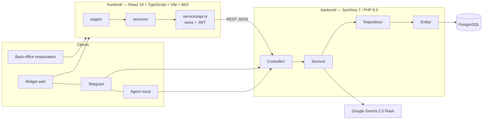

# Guide de soutenance — Naviguer et expliquer le code CALENDRIA

Objectif de ce document : pouvoir **ouvrir le bon fichier en moins de 10 secondes** quand le jury
demande « montrez-moi comment vous faites X », et savoir quoi dire dessus.

---

## 1. Carte mentale du projet en 30 secondes



**Phrase d'accroche à retenir :** *« Architecture 3-tiers découplée : un SPA React consomme une API REST
Symfony stateless authentifiée par JWT ; toute la logique métier de disponibilité est isolée dans un
service PHP unique, réutilisé par les 4 canaux de réservation. »*

---

## 2. Tableau « le jury demande X → j'ouvre Y »

### Backend (`backend/src/`)

| Question du jury | Fichier à ouvrir | Élément précis à montrer |
|---|---|---|
| « Comment gérez-vous l'authentification ? » | [backend/src/Controller/AuthController.php](../backend/src/Controller/AuthController.php) | `register()` → hachage via `UserPasswordHasherInterface` ; `login()` est vide car géré par le bundle JWT |
| « Où est configurée la sécurité ? » | [backend/config/packages/security.yaml](../backend/config/packages/security.yaml) | firewalls `login` et `api`, `access_control` |
| « Comment empêchez-vous le bruteforce ? » | [backend/src/EventSubscriber/LoginRateLimiterSubscriber.php](../backend/src/EventSubscriber/LoginRateLimiterSubscriber.php) | 5 échecs / 15 min par IP, réponse HTTP 429 |
| **« Expliquez votre algorithme de disponibilité »** ⭐ | [backend/src/Service/DisponibiliteService.php](../backend/src/Service/DisponibiliteService.php) | `verifierDisponibilite()`, puis `trouverTableDisponible()` |
| « Comment détectez-vous un conflit d'horaire ? » | [backend/src/Service/DisponibiliteService.php](../backend/src/Service/DisponibiliteService.php) | dans `trouverTableDisponible()` : `resStart < proposedEnd && proposedStart < resEnd` |
| « Et si c'est complet ? » | [backend/src/Service/DisponibiliteService.php](../backend/src/Service/DisponibiliteService.php) | `trouverAlternatives()` — 3 créneaux les plus proches, pas de 30 min |
| « Comment marche le chatbot IA ? » ⭐ | [backend/src/Service/ChatbotService.php](../backend/src/Service/ChatbotService.php) | `traiterMessage()` : prompt système, `responseMimeType: application/json`, session en cache |
| « Le chatbot écrit-il directement en base ? » | [backend/src/Service/ChatbotService.php](../backend/src/Service/ChatbotService.php) | Non : l'IA extrait les données, le **PHP** vérifie la dispo puis persiste |
| « Comment marche Telegram ? » | [backend/src/Controller/ChatbotController.php](../backend/src/Controller/ChatbotController.php) | `telegram()` — webhook, session `telegram_<chatId>`, commandes `/start` et `/reset` |
| « Et la réservation par téléphone ? » | [backend/src/Controller/ChatbotController.php](../backend/src/Controller/ChatbotController.php) | `callWebhook()` — payload déjà structuré, extraction tolérante des noms de champs |
| « Montrez le CRUD réservation » | [backend/src/Controller/ReservationController.php](../backend/src/Controller/ReservationController.php) | `createReservation()`, `updateReservation()`, `deleteReservation()` |
| « Comment évitez-vous les doublons de clients ? » | [backend/src/Controller/ReservationController.php](../backend/src/Controller/ReservationController.php) | `findOneBy(['telephone' => ...])` : le téléphone est la clé métier |
| « Où paramètre-t-on horaires et tables ? » | [backend/src/Controller/RestaurantAdminController.php](../backend/src/Controller/RestaurantAdminController.php) | `createService()`, `createTable()` |
| « Montrez votre modèle de données » | [backend/src/Entity/](../backend/src/Entity/) | `Reservation.php` d'abord (cœur des relations), puis `Restaurant.php` |
| « Pourquoi des backticks sur `table` ? » | [backend/src/Entity/Table.php](../backend/src/Entity/Table.php) | mot réservé SQL |
| « Comment testez-vous ? » | [backend/tests/Service/DisponibiliteServiceTest.php](../backend/tests/Service/DisponibiliteServiceTest.php) | tests unitaires avec mocks, sans base |
| « Vos données de démo ? » | [backend/src/DataFixtures/AppFixtures.php](../backend/src/DataFixtures/AppFixtures.php) | 1 admin, 1 restaurant, 10 tables, 2 services, 5 clients, 7 réservations |
| « Où sont vos clés d'API ? » | [backend/config/services.yaml](../backend/config/services.yaml) | injectées par `bind:` depuis les variables d'environnement, jamais en dur |

### Frontend (`frontend/src/`)

| Question du jury | Fichier à ouvrir | Élément précis à montrer |
|---|---|---|
| « Comment le token est-il envoyé ? » ⭐ | [frontend/src/services/api.ts](../frontend/src/services/api.ts) | intercepteur de requête (ajout du `Bearer`) + intercepteur de réponse (401 → logout) |
| « Où sont vos routes ? » | [frontend/src/App.tsx](../frontend/src/App.tsx) | `AppContent()` + le composant `PrivateRoute` |
| « Comment protégez-vous les pages ? » | [frontend/src/App.tsx](../frontend/src/App.tsx) | `PrivateRoute` — garde-fou UX ; **la vraie sécurité est le JWT côté API** |
| « Le mode sombre ? » | [frontend/src/App.tsx](../frontend/src/App.tsx) | `getAppTheme()` + `ThemeContext`, préférence persistée en `localStorage` |
| **« Montrez votre plan de salle »** ⭐ | [frontend/src/pages/Dashboard.tsx](../frontend/src/pages/Dashboard.tsx) | fonction `getTableStatus()` : 4 états (libre / réservée / imminente / occupée) |
| « Pourquoi le curseur horaire ? » | [frontend/src/pages/Dashboard.tsx](../frontend/src/pages/Dashboard.tsx) | `mapTimeMinutes` en minutes depuis minuit → permet de « rejouer » la journée |
| « Création d'une réservation côté front » | [frontend/src/pages/Dashboard.tsx](../frontend/src/pages/Dashboard.tsx) | `handleSubmit()` |
| « Le back-office de paramétrage » | [frontend/src/pages/RestaurantManagement.tsx](../frontend/src/pages/RestaurantManagement.tsx) | liste maître / panneau détail ; `handleConfirmDelete()` mutualisé |
| « Le widget de chat » | [frontend/src/pages/ChatWidget.tsx](../frontend/src/pages/ChatWidget.tsx) | route publique `/widget?restaurantId=1`, intégrable en iframe |
| « Pourquoi axios direct dans chatbot.service ? » | [frontend/src/services/chatbot.service.ts](../frontend/src/services/chatbot.service.ts) | routes publiques : le client final n'est pas authentifié, pas de JWT à envoyer |
| « Validation des formulaires » | [frontend/src/pages/Register.tsx](../frontend/src/pages/Register.tsx) | `react-hook-form` : email, 8 caractères mini, confirmation |
| « Le typage TypeScript ? » | [frontend/src/services/reservation.service.ts](../frontend/src/services/reservation.service.ts) | les interfaces reflètent exactement le JSON de l'API |

### Infrastructure

| Question | Fichier |
|---|---|
| « Comment on lance le projet ? » | [docker-compose.yml](../docker-compose.yml), [documentation/INSTALLATION.md](INSTALLATION.md) |
| « L'image du backend ? » | [docker/backend/Dockerfile](../docker/backend/Dockerfile) |
| « Le schéma de base ? » | [backend/migrations/](../backend/migrations/) |
| « CORS ? » | [backend/config/packages/nelmio_cors.yaml](../backend/config/packages/nelmio_cors.yaml) |

---

## 3. Les 3 morceaux de code à savoir expliquer par cœur

### 3.1 La détection de conflit — `DisponibiliteService::trouverTableDisponible()`

```php
$dureeTotale = ($restaurant->getDureeRepas() + $restaurant->getBufferNettoyage()) * 60;
$proposedEnd = $proposedStart + $dureeTotale;
// ...
if ($resStart < $proposedEnd && $proposedStart < $resEnd) {
    $estLibre = false;
}
```

**À dire :** « Une réservation n'est pas un point dans le temps, c'est un **intervalle**
`[début, début + durée repas + nettoyage[`. Deux intervalles se chevauchent si et seulement si
`A.début < B.fin ET B.début < A.fin`. C'est le test classique d'intersection d'intervalles, en O(1). »

**Si on vous demande la complexité :** O(tables × réservations du jour). On aurait pu filtrer
en SQL, mais le volume par restaurant et par jour reste faible.

**Optimisation à mettre en avant :** les tables sont triées par capacité croissante (`usort`),
donc on affecte toujours la **plus petite table suffisante** → on préserve les grandes tables
pour les grands groupes, ce qui maximise le taux de remplissage.

### 3.2 L'IA qui ne décide pas — `ChatbotService::traiterMessage()`

**À dire :** « Le choix d'architecture le plus important du projet : Gemini ne sert qu'à **dialoguer et
extraire** 5 informations dans un JSON strict. Il n'a aucun accès à la base. C'est le code PHP qui
appelle `DisponibiliteService` puis persiste. Conséquence : **l'IA ne peut pas halluciner une
disponibilité**. En cas de panne de l'API Gemini, on dégrade proprement avec un message d'excuse. »

Points techniques à citer :
- `responseMimeType: 'application/json'` force une sortie parsable.
- L'état de conversation vit dans le **cache Symfony** (clé `chatbot_session_<id>`, TTL 30 min) :
  le service reste **stateless**, donc scalable horizontalement.
- La capacité de la plus grande table est injectée dynamiquement dans le prompt pour que l'IA
  refuse d'emblée les groupes trop nombreux.

### 3.3 L'intercepteur JWT — `frontend/src/services/api.ts`

**À dire :** « Un seul point d'entrée HTTP pour toute l'application. L'intercepteur de requête
ajoute le `Bearer` automatiquement : aucune page n'a à connaître le token. L'intercepteur de
réponse centralise la gestion de l'expiration — un 401 purge le token et redirige vers `/login`,
sauf sur `/login` lui-même où un 401 signifie simplement "mauvais identifiants". »

---

## 4. Déroulé de démonstration conseillé (~6 min)

1. **Connexion** (`admin@calendria.com` / `password123`) → montrer l'onglet Réseau : le token JWT revient.
2. **Plan de salle** : bouger le curseur horaire, une table passe de verte à orange puis rouge.
   → *« C'est ici qu'on voit la règle des 90 + 15 minutes appliquée visuellement. »*
3. **Créer une réservation** sur un créneau déjà pris → le backend renvoie un 409 avec un message métier.
4. **Widget chat** (`/widget?restaurantId=1`) : réserver en langage naturel (« une table pour 2 demain soir à 20h »).
5. **Telegram** : scanner le QR code du dashboard et faire la même chose depuis un téléphone.
6. Revenir sur le dashboard → la réservation créée par l'IA apparaît dans la liste.

**Plan B si le réseau tombe :** avoir des captures d'écran des étapes 4-5, et se rabattre sur
l'explication du code de `ChatbotService`.

---

## 5. Questions pièges et réponses préparées

| Question | Réponse courte |
|---|---|
| « Pourquoi pas API Platform pour tout ? » | Le bundle est installé, mais les règles métier (disponibilité, création conditionnelle du client) justifiaient des contrôleurs explicites, plus lisibles et plus testables. |
| « Vos contrôleurs ne sont-ils pas trop gros ? » | La logique métier est bien sortie dans `Service/`. Les contrôleurs ne font que valider, orchestrer et sérialiser. L'évolution prévue serait d'extraire la sérialisation dans des DTO. |
| « Deux clients réservent la même table en même temps ? » | La vérification est faite juste avant le `flush()`. Le verrou pessimiste Doctrine ou une contrainte d'unicité en base serait la parade complète — c'est une limite identifiée et assumée. |
| « Et le RGPD ? » | Champ `consentementRgpd` sur `Client`, données minimales collectées (nom, téléphone, email facultatif), aucune donnée de paiement. |
| « Pourquoi le mot de passe n'est jamais renvoyé ? » | `register()` ne sérialise que `id`, `email`, `roles`. Le hachage est délégué à Symfony (algorithme `auto`). |
| « Que se passe-t-il si Gemini est indisponible ? » | Bloc `try/catch` dans `traiterMessage()` : message d'excuse, la session n'est pas corrompue, le back-office reste totalement fonctionnel. |
| « Pourquoi dupliquer la règle de durée côté front ? » | Uniquement pour l'**affichage** instantané du plan de salle sans aller-retour réseau. La vérité fait toujours autorité côté serveur lors de l'écriture. |
| « Vos tests couvrent quoi ? » | Le cœur métier (`DisponibiliteService`) en unitaire avec mocks, et les cas d'erreur des endpoints publics en fonctionnel. |

---

## 6. Antisèche de vocabulaire

- **Stateless** : le serveur ne garde pas de session utilisateur ; le JWT porte l'identité.
- **JWT** : jeton signé (clés dans `config/jwt/`), vérifié à chaque requête par Lexik.
- **Injection de dépendances** : Symfony construit et fournit les services via l'autowiring (`config/services.yaml`).
- **ORM / Doctrine** : les classes de `Entity/` sont mappées aux tables via les attributs PHP 8.
- **Repository** : couche d'accès aux données, une classe par entité.
- **EventSubscriber** : branchement sur le cycle de vie des requêtes (ici, le rate limiting).
- **Intercepteur axios** : middleware côté client, appliqué à toutes les requêtes HTTP.
- **Hook React** : `useState` (état local), `useEffect` (effets de bord), `useMemo` (calcul mémoïsé).

---

## 7. Checklist avant de passer

- [ ] `docker compose up` lancé et vérifié **avant** d'entrer dans la salle
- [ ] Fixtures rechargées (`php bin/console doctrine:fixtures:load`) pour partir d'un état propre
- [ ] Onglets VS Code pré-ouverts : `DisponibiliteService.php`, `ChatbotService.php`, `Dashboard.tsx`, `api.ts`
- [ ] Bot Telegram testé le jour même (le token expire si le webhook n'est plus enregistré)
- [ ] Captures d'écran de secours pour la démo IA
- [ ] Navigateur en mode clair (les projecteurs rendent mal le mode sombre)
